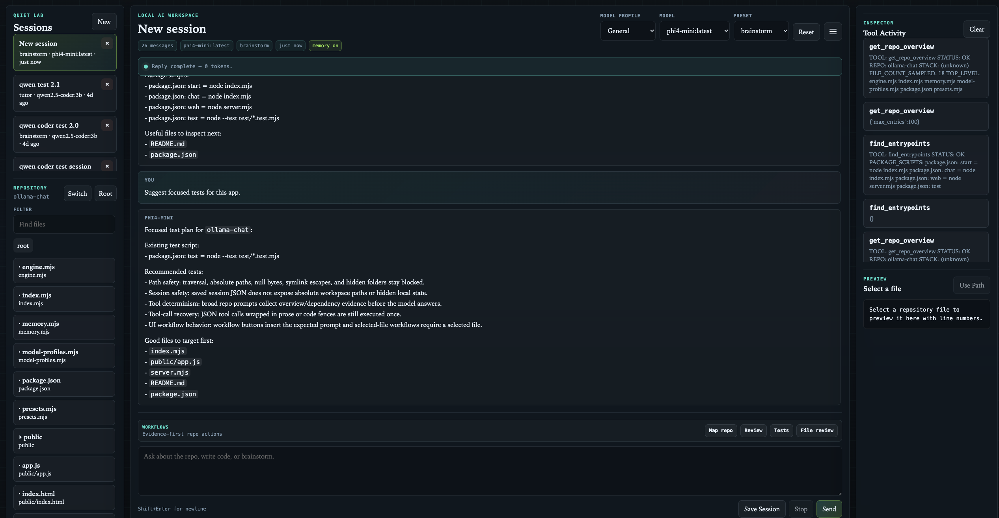
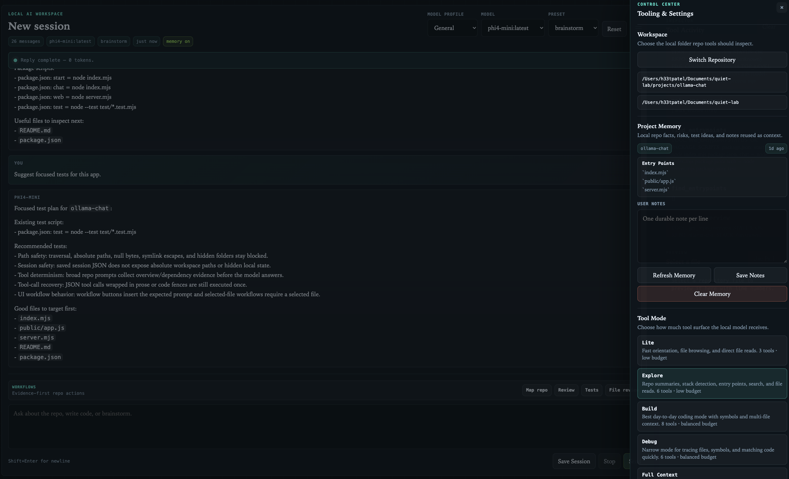
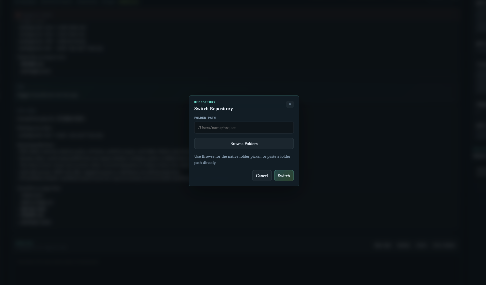
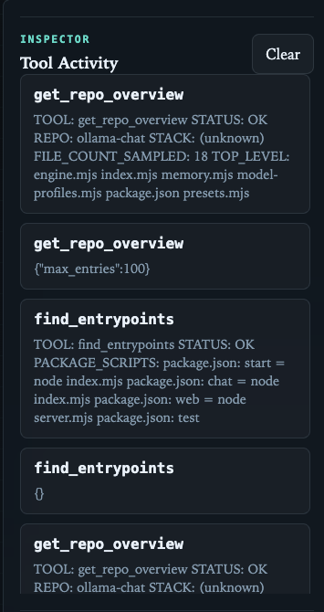
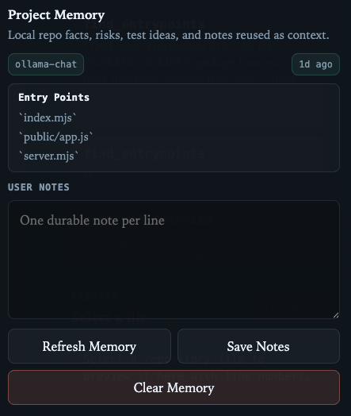

# ollama-chat

Minimal zero-dependency CLI chat app for the local `Ollama` API.

It now supports:

- streamed replies
- auto-saved local session history
- preset system prompts for different modes
- read-only repository tools for file listing, file reading, and search
- configurable tool profiles and resource budgets for smaller local models
- stricter grounded answers for repo questions
- a local browser UI with sessions, repo browsing, and tool activity
- model profiles (quick shortcuts to swap Ollama tags) and stop during streaming generation

## Run

```bash
cd projects/ollama-chat
npm start
```

Use a specific model:

```bash
npm start -- qwen2.5:7b
```

Use a specific preset:

```bash
npm start -- --preset summarize
```

Run the browser UI:

```bash
npm run web
```

Then open:

```text
http://127.0.0.1:4317
```

## Environment

- `OLLAMA_MODEL`: default model if no CLI arg is passed
- `OLLAMA_BASE_URL`: defaults to `http://127.0.0.1:11434`
- `OLLAMA_CHAT_HOST`: defaults to `127.0.0.1`
- `OLLAMA_CHAT_PORT`: defaults to `4317`
- `OLLAMA_CHAT_TOKEN`: optional API token; required when binding to `0.0.0.0` or `::`
- `OLLAMA_SYSTEM`: optional system prompt
- `OLLAMA_PRESET`: default preset if no CLI preset is passed
- `OLLAMA_REPO_ROOT`: attached repository root for CLI mode (defaults to the workspace root)
- `OLLAMA_SESSION`: default CLI session id (defaults to `latest`)
- `OLLAMA_TOOL_PROFILE`: `minimal`, `explore`, `coding`, `debug`, or `deep`; defaults to `explore`
- `OLLAMA_RESOURCE_BUDGET`: `low`, `balanced`, or `expanded`; defaults to the profile budget

## Commands

- `/reset`: clear the current chat history
- `/preset NAME`: switch presets and clear the current chat history
- `/presets`: list the available presets
- `/tools`: list the available repo tools
- `/status`: show the current model, preset, and session location
- `/exit`: quit

## Browser UI

Served from `server.mjs`.

## Screenshots



_Main chat with session list, composer, and streamed reply._


_Tool profiles/budgets, model profiles, and preset controls._


_Workspace attach flow with repo tree and file preview._


_A tool-backed response showing tool calls and results._


_Project memory summary and user notes._

### Model profiles

The header **Model profile** menu switches the active Ollama model tag without resetting chat history (same as changing **Model**, but grouped as shortcuts). Built-in profiles are defined in `model-profiles.mjs` (General → `phi4-mini`, Coding → `qwen2.5-coder:3b`, Heavy → `qwen2.5:7b`). If a tag is not installed locally, the UI falls back to the nearest name match or the server default.

In Control Center you can add **custom model profiles** (name + tag); they are stored in `localStorage` for this browser only.

**Stop** cancels an in-flight streamed reply: the browser aborts the request, the server aborts the Ollama call, and the last user message is rolled back so you can edit and resend.

- session sidebar
- model and preset controls
- streamed chat panel
- tool activity inspector
- attach-codebase flow for selecting a local folder from the UI
- repo tree and file preview for the attached codebase
- repo filtering, quick prompts, and selected-file prompt helpers

It reuses the same local repo-aware backend logic as the CLI.

On first launch, attach a codebase from the Repository panel by pasting a local folder path. Recent codebases are remembered locally for reuse. The web API includes the active `repoName` (workspace folder name) in session payloads, not the absolute repository path. Recent-codebase paths are exposed only through the local workspace endpoint used by the attach dialog.

Detaching a codebase (`detachCodebase`) sets the active repo root to null and persists that state. Callers should treat the workspace as unattached immediately after the call; any pending tool calls that rely on the repo root will fail gracefully.

Run `npm test` from this directory; GitHub Actions runs these tests on pushes and pull requests to `main`.

## Presets

- `coder`: concise coding help
- `brainstorm`: generate and compare ideas
- `repo`: read-only repo inspection and codebase Q&A
- `summarize`: compact summaries and distillation
- `tutor`: step-by-step explanations

## Repo Tools

The model can use a small set of read-only tools inside the attached codebase:

- `get_repo_overview`
- `find_entrypoints`
- `inspect_dependencies`
- `list_repo_files`
- `read_many_files`
- `read_repo_file`
- `search_repo`
- `summarize_file_symbols`

These tools are intentionally limited to the attached repository root. They do not write files, run shell commands, or access the app's configured hidden paths (for example `.git`, `.vscode`, `.idea`, `node_modules`, `models/.ollama`, and local `sessions` data).

Tooling is now routed through profiles and resource budgets so small Ollama models do not receive every possible tool or oversized results. The default `explore` profile uses the `low` budget:

- `minimal`: repo overview, file listing, and file reading — `low` budget
- `explore`: repo summaries, stack detection, entry points, search, and file reads — `low` budget (default)
- `coding`: all of the above plus multi-file reads and symbol summaries — `balanced` budget
- `debug`: narrow mode for tracing files, symbols, and matching code — `balanced` budget
- `deep`: all repo tools with the largest context budget — `expanded` budget

Budgets cap tool rounds, preloaded context, directory entries, file lines, and search results. The browser backend exposes `/api/tooling` so a future settings panel can switch profiles without changing the model-facing architecture.

For repo questions, the CLI now hides the model's pre-tool chatter and only shows explicit tool calls plus the grounded answer. This reduces fake shell-style narration and makes wrong inferences easier to spot.

## Project Memory

Project memory is a small structured record of facts about the attached repository — stack, entry points, package scripts, known risks, recommended tests, and your own notes. It is stored in `sessions/memory/<repo-name>.json` (gitignored) and is loaded fresh on every chat turn where repo tools are invoked.

Memory is injected into the model as a system-role prefix so it lands before any conversation history. This makes it more reliable than injecting as a user message, particularly on small models. The memory block is capped at ~1200 characters to protect the model's usable context window.

Facts are written only from structured tool output (`get_repo_overview`, `inspect_dependencies`). There is no heuristic free-text extraction — you get clean facts or nothing.

Add free-form notes in Control Center → Project Memory → User Notes. These are the only user-authored content stored in memory; all other fields are derived from tool calls.

## Session History

Session state is saved locally to `projects/ollama-chat/sessions/latest.json`.

That directory is ignored by git and is meant for local use only.

## Security Notes

- The browser API is intended for local use.
- When `OLLAMA_CHAT_HOST` is loopback (`127.0.0.1`/`localhost`/`::1`), only loopback clients are accepted.
- If you bind to `0.0.0.0` or `::`, set `OLLAMA_CHAT_TOKEN`; startup fails without it.
- For browser access with a token, open the UI as `http://HOST:PORT/?token=YOUR_TOKEN` once; the UI stores it in local browser storage for later requests.
- For mutation routes (`POST`, `PUT`, `PATCH`, `DELETE`), the server requires a valid `Origin`.
- Session writes are now serialized and atomically committed to reduce race-condition data loss.

## README Screenshot Guide

Capture screenshots from a clean local run (`npm run web`) and save them in a new `projects/ollama-chat/docs/images/` folder.

Suggested files:
- `chat-main.png`
- `control-center.png`
- `repo-attach-and-tree.png`
- `tool-activity.png`
- `memory-panel.png`

What to capture:
- **Main chat view (`chat-main.png`)**
  - Session sidebar visible with at least 2 sessions
  - Composer with a short prompt
  - Chat stream result shown
  - Status bar visible
- **Control Center (`control-center.png`)**
  - Tool profile + budget controls visible
  - Model profile section visible (built-in + custom)
  - Preset controls visible
- **Repository attach and tree (`repo-attach-and-tree.png`)**
  - Attach dialog (or recently attached workspace list)
  - Repo tree expanded to 1-2 nested directories
  - File preview pane open
- **Tool activity (`tool-activity.png`)**
  - A completed prompt that triggered tools
  - Tool call + result cards visible
- **Project memory (`memory-panel.png`)**
  - Memory summary populated
  - User notes area visible

How to capture cleanly:
- Use a dedicated demo session with fake/sanitized prompts.
- Keep browser zoom at `100%` and use the same window width for all screenshots.
- Prefer light or dark mode consistently across all captures.
- Avoid absolute local paths, API tokens, personal names, or private repo names in view.
- Crop to the app frame only (exclude browser bookmarks/tabs if possible).

Recommended README placement:
- Add a `## Screenshots` section after `## Browser UI`.
- Use one short caption per image describing the user task shown.

## Notes

On memory-constrained machines, the default is `phi4-mini` (good reasoning and code for ~3–4B). Override with `OLLAMA_MODEL` if you prefer another tag.

If you are using different hardware, adjust the model choice accordingly.
